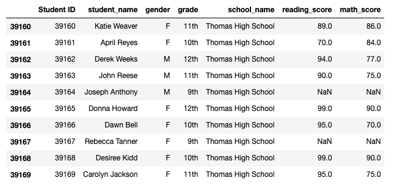
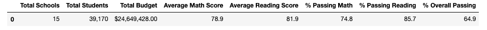

# School_District_Analysis
Performing an updated analysis on student and school data using Pandas. 

## Overview of Project 
### Purpose
In this project, we helped Maria update and analyze school and student datasets to produce meaningful information about reading and math scores in relation to each school's overall performance, spending, size and type. The updated code also ommitted grade 9 reading and math scores from Thomas High School on suspicion of academic dishonesty. The final code and analysis will be used by Maria and the school board to get a better understanding of the district's performance, while avoiding possible incorrect values but keeping all other data intact.

## Results 
This updated analysis slightly varies from the initial analysis ([Original School District Analysis](PyCitySchools.ipynb)) as the reading and math scores from Thomas High School's grade 9 was replaced with NaN (Not a Number), but leaving all other data intact. Below is a screenshot that shows the replacement of selected data with NaN.

1) The district summary provided information on the total number of schools, students and budget in the district, average math and reading scores across the schools, as well as the percentage of passing students. The district summary from the updated analysis (as shown below), remained the same as the original analysis except for one value, average math score. The average math score in the updated analysis decreased by 0.1% in comparison to the original. 

2) The school summary provided information on the total number of schools, students and budget in the district, average math and reading scores across the schools, as well as the percentage of passing students. The district summary from the updated analysis (as shown below), remained the same as the original analysis except for one value, average math score. The average math score in the updated analysis decreased by 0.1% in comparison to the original. 
