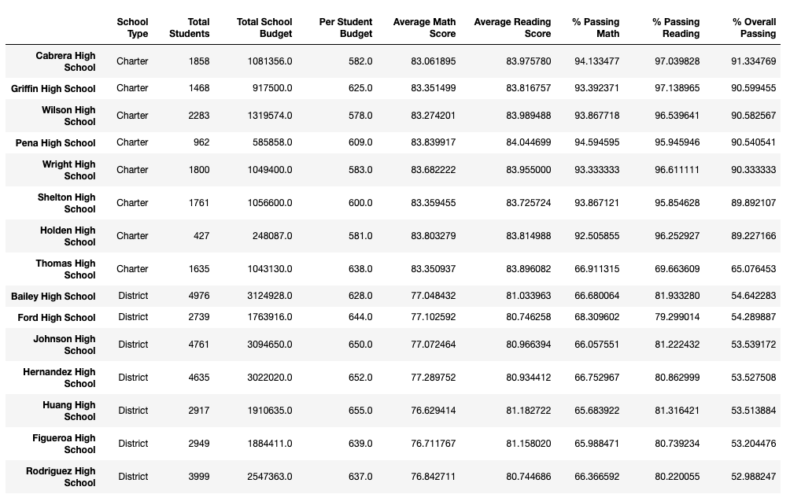

# School_District_Analysis
Performing an updated analysis on student and school data using Pandas. 

## Overview of Project 
### Purpose
In this project, we helped Maria update and analyze school and student datasets to produce meaningful information about reading and math scores in relation to each school's overall performance, spending, size and type. The updated code also ommitted grade 9 reading and math scores from Thomas High School on suspicion of academic dishonesty. The updated summaries will be used by Maria and the school board to get a better understanding of the district's performance, while avoiding possible incorrect values but keeping all other data intact.

## Results 
This updated analysis slightly varies from the initial analysis ([Original School District Analysis](PyCitySchools.ipynb)) as the reading and math scores from Thomas High School's grade 9 was replaced with NaN (Not a Number), but leaving all other data intact. Below is a screenshot that shows the replacement of selected data with NaN, after using the numpy.nan or np.nan function.

1) The district summary provided information on the total number of schools, students and budget in the district, average math and reading scores across the district, as well as the percentage of passing students. The district summary from the updated analysis (as shown below), remained the same as the original analysis except for one value, average math score. The average math score in the updated analysis decreased by 0.1% in comparison to the original. 

2) The school summary provided information on the size, type, budget, average scores and percentage passing for each school. The school summary from the updated analysis (as shown below), was significantly altered in comparison to the original analysis. Once the reading and math scores from Thomas High School grade 9 was replaced with NaN, the % Passing Math, % Passing Reading and % Overall Passing went down to 66.9%,	69.7% and 65.1%, respectively. Before the values were replaced, the % Passing values were all above 90%. The other values remained the same. 

3)Replacing the ninth graders' math and reading scores significantly lowered Thomas High School's overall performance. Prior to replacement, Thomas High School was in the top 5 schools based on % Overall Passing. After replacement, Thomas High School went down to 8th place out of 15 schools. Shown below is the ranking of the schools after replacement of Thomas High School's ninth graders' math and reading scores, after using the sort_values function. 

4)Both the reading and math scores by grade were not affected by the replacement for grades 10 through 12. However, the reading and math scores for ninth graders at Thomas High School was marked as nan. This is understandable as we had replaced those values with NaN at the beginning of the project. Shown below are the reading and math scores by grade with school name being the index. 

 
